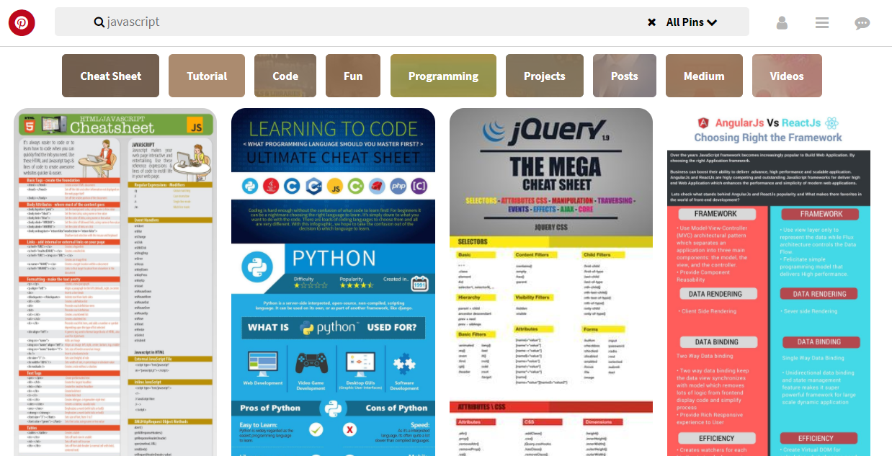

# Pinterest (maquetado) #

## Introducción

El presente trabajo consiste en replicar la siguiente imagen:

## Contenido de las carpetas

Se tienen dos carpetas principales, la primera llamada assets, donde se alojan dos carpetas adicionales llamadas icons e images. En la carpeta images se almacena la imagen utilizada en este Readme y las imágenes utilizadas en el archivo html. En la segunda carpeta llamada css, se almacena el archivo main.css usado para dar estilo y diseño a la página web.